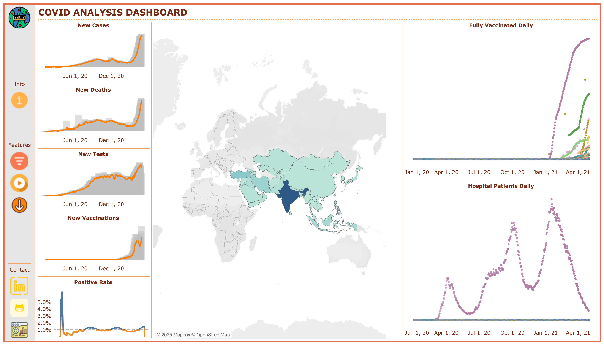

# COVID-19 Data Analysis Project

## Overview

This project leverages datasets from [Our World in Data](https://ourworldindata.org/covid-deaths) to explore critical aspects of the COVID-19 pandemic. The two datasets used are:

- **CovidVaccinations.csv**: This dataset contains information about vaccination rollouts worldwide.
- **CovidDeaths.csv**: This dataset provides details about COVID-19 deaths across different countries and regions.

By combining these datasets, the project aims to uncover insights into how vaccination efforts impacted mortality rates globally and regionally.

---

## Why I Chose This Project

COVID-19 has been a defining event of our time, profoundly affecting millions of lives. As someone passionate about data analysis, I believe that exploring such impactful data is an opportunity to better understand the pandemic's dynamics and to contribute to meaningful insights. Through this project, I aim to:

- **Understand Trends**: Investigate the temporal and spatial trends of COVID-19 deaths and vaccinations.
- **Draw Connections**: Analyze relationships between vaccination rates and mortality trends.
- **Enhance Skills**: Improve my ability to clean, visualize, and interpret real-world datasets.

This project is personal to me because it allows me to connect my analytical skills with a topic of global significance. I hope this analysis can be a small step toward understanding what worked during the pandemic and what could be improved for future health crises.

---

## What I Will Learn

By completing this project, I plan to:

### Data Wrangling

- Gain experience in handling real-world data, including cleaning and preprocessing datasets to make them analysis-ready.

### Exploratory Data Analysis (EDA)

- Explore trends, patterns, and correlations within the datasets using Python and SQL.

### Data Visualization

- Create intuitive visualizations to communicate findings effectively. This will likely involve tools like Tableau or Matplotlib/Seaborn.

### Insights and Storytelling

- Practice deriving actionable insights from data and presenting them in a compelling narrative format.

---

## Data Source

The datasets used in this project are publicly available and can be accessed from [Our World in Data](https://ourworldindata.org/covid-deaths). The data is meticulously curated to provide comprehensive information on global vaccination efforts and COVID-19 mortality trends.

---

## Project Goals

1. **Analyze Global Trends**: Examine how vaccination rates and COVID-19 deaths have evolved globally over time.
2. **Impact Analysis**: Investigate the impact of vaccination on reducing COVID-19 mortality.
3. **Regional Insights**: Identify disparities and trends in different countries or regions.

---

## Tools and Technologies

- **Data Analysis**: Python (Pandas, NumPy), SQL (PostgreSQL)
- **Visualization**: Tableau, Matplotlib, Seaborn
- **Documentation**: Markdown for clear and structured documentation

---

## How dashboard look like

---

## Acknowledgments

Special thanks to [Our World in Data](https://ourworldindata.org/covid-deaths) for making this data accessible to researchers and enthusiasts worldwide.

---

## Next Steps

1. **Data Cleaning and Preprocessing**: Prepare the datasets for analysis by handling missing values and ensuring consistency.
2. **Exploratory Analysis**: Uncover preliminary insights using descriptive statistics and visualizations.
3. **Advanced Analysis**: Dive deeper into correlations and trends using advanced techniques.
4. **Documentation and Presentation**: Summarize the findings in a report and interactive visualizations.

Stay tuned for updates and insights from this project!
