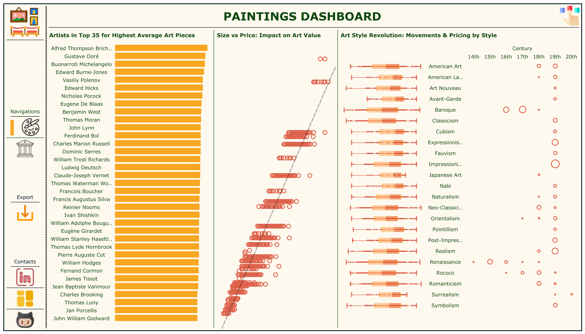
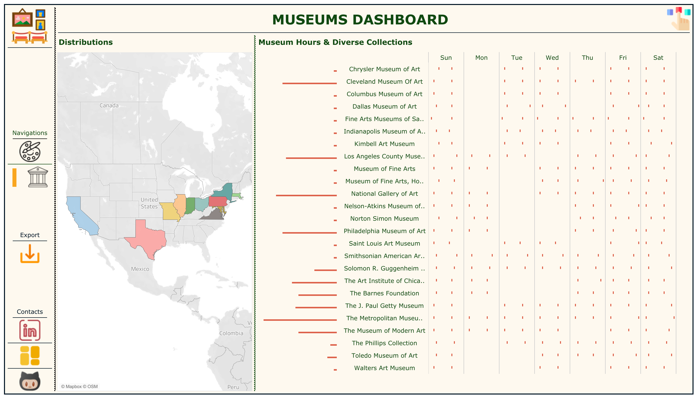

# Famous Paintings Analysis

## Overview

This project explores the dataset of famous paintings sourced from [Kaggle](https://www.kaggle.com/datasets/mexwell/famous-paintings?resource=download&select=canvas_size.csv). The dataset provides information about various iconic works of art, including their canvas sizes, which opens the door to creative visualization and insightful analysis. The primary goal of this project is to uncover patterns and trends in the dimensions of these masterpieces and to present the findings using Tableau.

## Why This Project?

Art has always fascinated me, not just for its aesthetic value but also for the underlying data that shapes how we perceive it. By working on this project, I aim to merge two of my passions—data analysis and visual storytelling—to gain a deeper appreciation of the art world. Through this analysis, I hope to:

1. Highlight the diversity in canvas sizes used by renowned artists.
2. Understand how dimensions correlate with artistic movements or periods.
3. Create engaging and interactive Tableau visualizations to make art history accessible and data-driven.

## What I Will Learn

This project will allow me to:

1. **Refine SQL and data preparation skills** by cleaning and transforming the dataset for analysis.
2. **Enhance my Tableau expertise** through the creation of interactive and visually appealing dashboards.
3. **Develop storytelling skills** by turning raw data into meaningful insights that connect art enthusiasts and data lovers alike.
4. **Expand my knowledge of art history** by diving into the context behind the data.

## Data Source

The dataset for this project is sourced from Kaggle and can be accessed [here](https://www.kaggle.com/datasets/mexwell/famous-paintings?resource=download&select=canvas_size.csv). Special thanks to the creator for compiling this valuable resource.

## How dashboard look like

## Tableau Visualizations

The results of this analysis will be showcased on my Tableau Public profile. You can explore my interactive dashboards and visualizations [here](https://public.tableau.com/app/profile/nha.alvarado/vizzes).

## Next Steps

1. Clean and preprocess the dataset to ensure accuracy and consistency.
2. Perform exploratory data analysis (EDA) to uncover interesting trends.
3. Design Tableau dashboards to visualize key insights effectively.
4. Share findings and reflections through the Tableau Public platform.

## Acknowledgments

- **Kaggle**: For providing the dataset.
- **Tableau**: For enabling powerful and interactive visual storytelling.
- **Art Lovers**: For inspiring this journey into the intersection of art and data.

Thank you for joining me on this journey of exploring art through data!
