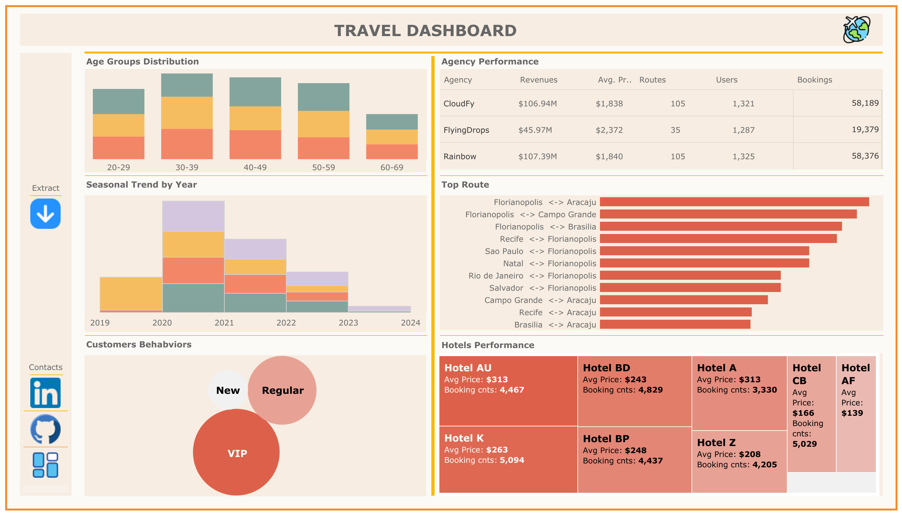

# Argo Datathon 2019 - Travel Dataset Analysis

## Why This Dataset?

As a passionate traveler, I always seek new experiences wherever I go. Travel is more than just visiting places; it’s about understanding customer preferences, optimizing travel services, and enhancing user experiences. This inspired me to analyze the **[Argo Datathon 2019 Travel Dataset from Kaggle](https://www.kaggle.com/datasets/leomauro/argodatathon2019)** to uncover insights that can improve travel recommendations and services. By leveraging data, I aim to answer critical business questions and enhance the overall travel experience.

## The Big Question

This project aligns with a key business challenge:

> **"How can Argo offer the best travel experience for its customers?"**

By analyzing travel patterns, user behavior, and service preferences, we can provide data-driven recommendations that improve customer satisfaction and engagement.

## What I Learned

Through this project, I gained valuable insights into:

- **Customer travel patterns** and preferences based on historical data.
- **Service optimization** by analyzing booking trends, user ratings, and travel frequency.
- **Pricing strategies** and how affordability influences travel choices.
- **Geographic trends** to identify key travel destinations and hotspots.
- **Data warehouse processes**, essential for structuring and managing large-scale travel data.
- **Exploratory Data Analysis (EDA)** to clean, preprocess, and derive meaningful insights from data.
- **Advanced analytics techniques**, including predictive modeling and segmentation.
- **Effective visualization in Tableau**, creating dashboards that tell compelling stories.

## Data Warehouse Process

To ensure structured and efficient analysis, I applied **data warehousing principles**, such as:

1. **Extracting** raw travel data from Kaggle.
2. **Transforming** the data by handling missing values, standardizing formats, and enriching it with calculated fields.
3. **Loading (ETL process)** the refined data into a structured format for analysis in Tableau.

## Exploratory Data Analysis (EDA)

Before diving into advanced analytics, I conducted an in-depth EDA process:

- **Data cleaning:** Handling missing values, duplicate records, and inconsistencies.
- **Descriptive statistics:** Understanding distributions of travel frequency, pricing, and user reviews.
- **Feature engineering:** Creating new insights by categorizing destinations, trip types, and pricing ranges.
- **Correlations & trends:** Identifying factors influencing travel choices and customer satisfaction.

## Advanced Analytics & Visualization

With a clean dataset, I leveraged **Tableau** to build interactive dashboards focusing on:

- **Top travel destinations by user preference and rating.**
- **Price vs. satisfaction analysis** to determine cost-effective travel options.
- **Customer travel behavior analysis** to identify common travel patterns.
- **Geospatial analysis** to highlight travel hotspots and trends.

## How dashboard look like

Explore my **Tableau visualizations** here: [Tableau Public - Nha Alvarado](https://public.tableau.com/app/profile/nha.alvarado/vizzes)

## Conclusion

By analyzing this dataset, I provided insights that can help travel platforms like Argo offer the best possible experience for their customers. Whether it's optimizing travel routes, recommending destinations, or enhancing customer satisfaction, a data-driven approach ensures a seamless and enjoyable journey. This project reinforced my skills in data analytics, storytelling through visualization, and using Tableau to transform raw data into actionable insights.
